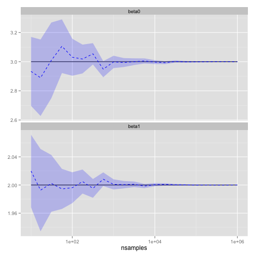
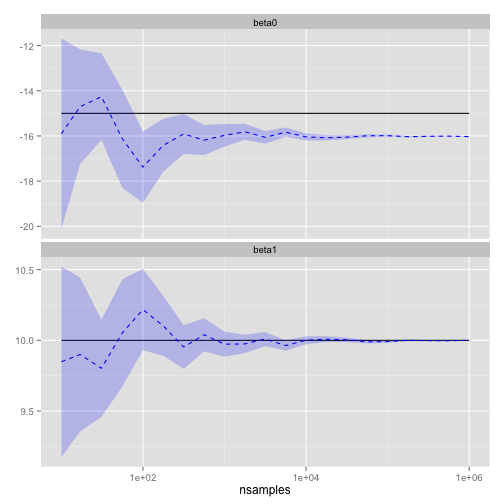

```r
# To make the html: echo "library(knitr); knit('het.Rmd')" | R --vanilla ; pandoc het.md -o het.html

library(ggplot2)

workProblem <- function(dAll,nreps,name,sampleSize=10) {
   xAll <- matrix(data=c(dAll$x0,dAll$x1),ncol=2)
   cAll <- solve(t(xAll) %*% xAll) %*% t(xAll)
   beta <- as.numeric(cAll %*% dAll$y)

   betaSamples <- matrix(data=0,nrow=2,ncol=nreps)
   nrows <- dim(dAll)[[1]]
   for(i in 1:nreps) {
      dSample <- dAll[sample.int(nrows,sampleSize,replace=TRUE),]
      individualError <- rnorm(sampleSize)
      dSample$y <- dSample$y + individualError
      dSample$e <- dSample$z + individualError
      xSample <- matrix(data=c(dSample$x0,dSample$x1),ncol=2)
      cSample <- solve(t(xSample) %*% xSample) %*% t(xSample)
      betaS <- as.numeric(cSample %*% dSample$y)
      betaSamples[,i] <- betaS
   }
   d <- c()
   for(i in 1:(dim(betaSamples)[[1]])) {
      coef <- paste('beta',(i-1),sep='')
      mean <- mean(betaSamples[i,])
      dev <- sqrt(var(betaSamples[i,])/nreps)
      d <- rbind(d,data.frame(nsamples=nreps,model=name,coef=coef,
         actual=beta[i],est=mean,estP=mean+2*dev,estM=mean-2*dev))
   }
   d
}

repCounts <- as.integer(floor(10^(0.25*(4:24))))


print('good example')
```

```
## [1] "good example"
```

```r
set.seed(2623496)
dGood <- data.frame(x0=1,x1=0:10)
dGood$y <- 3*dGood$x0 + 2*dGood$x1
dGood$z <- dGood$y - predict(lm(y~0+x0+x1,data=dGood))
print(dGood)
```

```
##    x0 x1  y          z
## 1   1  0  3 -9.326e-15
## 2   1  1  5 -7.994e-15
## 3   1  2  7 -7.105e-15
## 4   1  3  9 -5.329e-15
## 5   1  4 11 -5.329e-15
## 6   1  5 13 -3.553e-15
## 7   1  6 15 -1.776e-15
## 8   1  7 17 -3.553e-15
## 9   1  8 19  0.000e+00
## 10  1  9 21  0.000e+00
## 11  1 10 23  0.000e+00
```

```r
print(summary(lm(y~0+x0+x1,data=dGood)))
```

```
## Warning: essentially perfect fit: summary may be unreliable
```

```
## 
## Call:
## lm(formula = y ~ 0 + x0 + x1, data = dGood)
## 
## Residuals:
##       Min        1Q    Median        3Q       Max 
## -2.77e-15 -1.69e-15 -5.22e-16  4.48e-16  6.53e-15 
## 
## Coefficients:
##    Estimate Std. Error t value Pr(>|t|)    
## x0 3.00e+00   1.58e-15 1.9e+15   <2e-16 ***
## x1 2.00e+00   2.67e-16 7.5e+15   <2e-16 ***
## ---
## Signif. codes:  0 '***' 0.001 '**' 0.01 '*' 0.05 '.' 0.1 ' ' 1
## 
## Residual standard error: 2.8e-15 on 9 degrees of freedom
## Multiple R-squared:     1,	Adjusted R-squared:     1 
## F-statistic: 1.47e+32 on 2 and 9 DF,  p-value: <2e-16
```

```r
print(workProblem(dGood,10,'good/works',10000))
```

```
##   nsamples      model  coef actual   est  estP  estM
## 1       10 good/works beta0      3 3.006 3.016 2.995
## 2       10 good/works beta1      2 1.999 2.001 1.997
```

```r
pGood <- c()
set.seed(2623496)
for(reps in repCounts) {
  pGood <- rbind(pGood,workProblem(dGood,reps,'goodData'))
}
ggplot(data=pGood,aes(x=nsamples)) +
  geom_line(aes(y=actual)) +
  geom_line(aes(y=est),linetype=2,color='blue') +
  geom_ribbon(aes(ymax=estP,ymin=estM),alpha=0.2,fill='blue') +
  facet_wrap(~coef,ncol=1,scales='free_y') + scale_x_log10() +
  theme(axis.title.y=element_blank())
```

 

```r
dBad <- data.frame(x0=1,x1=0:10)
dBad$y <- dBad$x1^2 # or y = -15 + 10*x1 with structured error
dBad$z <- dBad$y - predict(lm(y~0+x0+x1,data=dBad))
print('bad example')
```

```
## [1] "bad example"
```

```r
print(dBad)
```

```
##    x0 x1   y   z
## 1   1  0   0  15
## 2   1  1   1   6
## 3   1  2   4  -1
## 4   1  3   9  -6
## 5   1  4  16  -9
## 6   1  5  25 -10
## 7   1  6  36  -9
## 8   1  7  49  -6
## 9   1  8  64  -1
## 10  1  9  81   6
## 11  1 10 100  15
```

```r
print(summary(lm(y~0+x0+x1,data=dBad)))
```

```
## 
## Call:
## lm(formula = y ~ 0 + x0 + x1, data = dBad)
## 
## Residuals:
##    Min     1Q Median     3Q    Max 
##  -10.0   -7.5   -1.0    6.0   15.0 
## 
## Coefficients:
##    Estimate Std. Error t value Pr(>|t|)    
## x0  -15.000      5.508   -2.72    0.023 *  
## x1   10.000      0.931   10.74    2e-06 ***
## ---
## Signif. codes:  0 '***' 0.001 '**' 0.01 '*' 0.05 '.' 0.1 ' ' 1
## 
## Residual standard error: 9.76 on 9 degrees of freedom
## Multiple R-squared:  0.966,	Adjusted R-squared:  0.959 
## F-statistic:  128 on 2 and 9 DF,  p-value: 2.42e-07
```

```r
print(workProblem(dBad,10,'bad/works',10000))
```

```
##   nsamples     model  coef actual    est   estP    estM
## 1       10 bad/works beta0    -15 -14.92 -14.81 -15.023
## 2       10 bad/works beta1     10   9.99  10.01   9.971
```

```r
print(sum(dBad$z*dBad$x0))
```

```
## [1] -7.816e-14
```

```r
print(sum(dBad$z*dBad$x1))
```

```
## [1] -1.013e-13
```

```r
pBad <- c()
set.seed(2623496)
for(reps in repCounts) {
  pBad <- rbind(pBad,workProblem(dBad,reps,'badData'))
}
ggplot(data=pBad,aes(x=nsamples)) +
  geom_line(aes(y=actual)) +
  geom_line(aes(y=est),linetype=2,color='blue') +
  geom_ribbon(aes(ymax=estP,ymin=estM),alpha=0.2,fill='blue') +
  facet_wrap(~coef,ncol=1,scales='free_y') + scale_x_log10() +
  theme(axis.title.y=element_blank())
```

 
