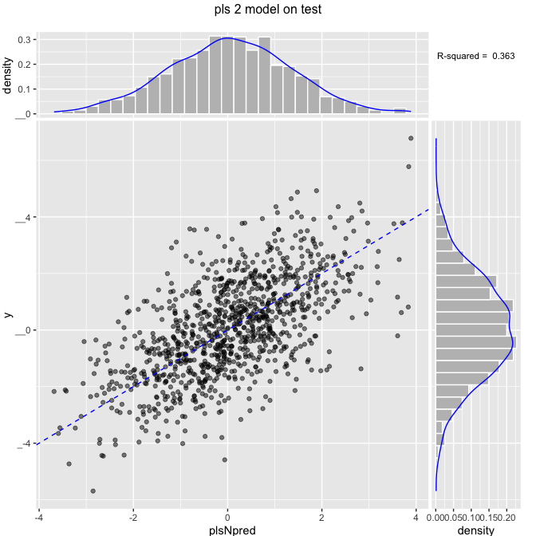
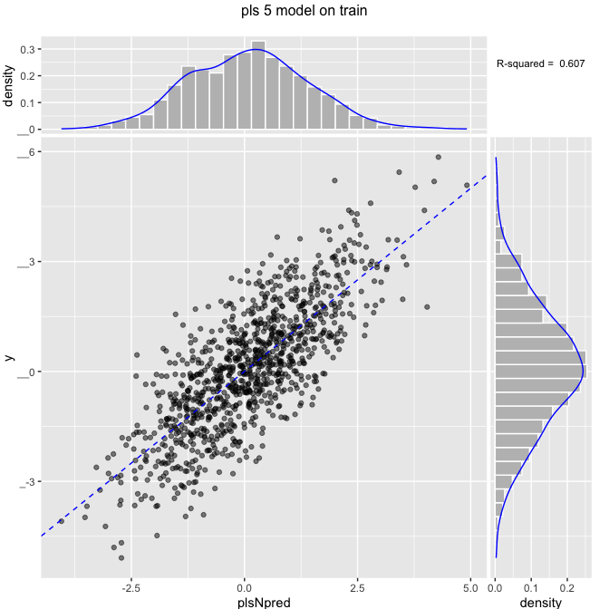
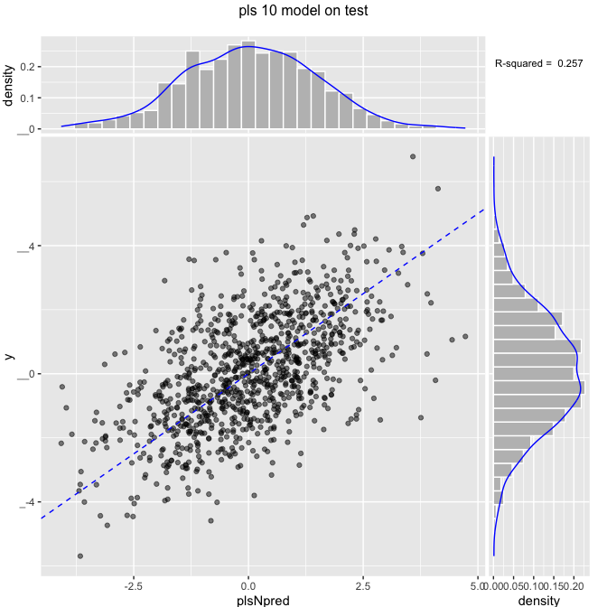
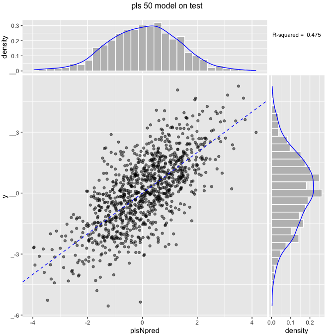

Partial least squares on same data as [Principal Components Regression, Pt. 2: Y-Aware Methods](https://github.com/WinVector/Examples/blob/master/PCR/YAwarePCA.md).

``` r
# build example where even and odd variables are bringing in noisy images
# of two different signals.
mkData <- function(n) {
  for(group in 1:10) {
    # y is the sum of two effects yA and yB
    yA <- rnorm(n)
    yB <- rnorm(n)
    if(group==1) {
      d <- data.frame(y=yA+yB+rnorm(n))
      code <- 'x'
    } else {
      code <- paste0('noise',group-1)
    }
    yS <- list(yA,yB)
    # these variables are correlated with y in group 1,
    # but only to each other (and not y) in other groups
    for(i in 1:5) {
      vi <- yS[[1+(i%%2)]] + rnorm(nrow(d))
      d[[paste(code,formatC(i,width=2,flag=0),sep='.')]] <- ncol(d)*vi
    }
  }
  d
}
```

``` r
# make data
set.seed(23525)
dTrain <- mkData(1000)
dTest <- mkData(1000)
```

Using latent components to model (partial least squares).

``` r
library("pls")
vars <- setdiff(colnames(dTrain),'y')
formula <- paste('y',paste(vars,collapse=' + '),sep=' ~ ')
for(ncomp in c(2,5,10,length(vars))) {
  print("###################")
  print(paste('ncomp',ncomp))
  modelN <- plsr(as.formula(formula), ncomp = ncomp, data = dTrain, 
                 scale=TRUE, validation = "CV")
  dTrain$plsNpred <- as.numeric(predict(modelN,newdata=dTrain,ncomp=ncomp,type='response'))
  ScatterHist(dTrain,'plsNpred','y',paste('pls',ncomp,'model on train'),
              smoothmethod='identity',annot_size=3)
  trainrsq <- rsq(dTrain$plsNpred,dTrain$y)
  print(paste("ncomp",ncomp,"train rsq",trainrsq))
  dTest$plsNpred <-as.numeric(predict(modelN,newdata=dTest,ncomp=ncomp,type='response'))
  ScatterHist(dTest,'plsNpred','y',paste('pls',ncomp,'model on test'),
              smoothmethod='identity',annot_size=3)
  testrsq <- rsq(dTest$plsNpred,dTest$y)
  print(paste("ncomp",ncomp,"test rsq",testrsq))
  print("###################")
}
```

    ## [1] "###################"
    ## [1] "ncomp 2"


    ## [1] "ncomp 2 train rsq 0.498555119996815"



    ## [1] "ncomp 2 test rsq 0.495483374174648"
    ## [1] "###################"
    ## [1] "###################"
    ## [1] "ncomp 5"



    ## [1] "ncomp 5 train rsq 0.505145624334339"


    ## [1] "ncomp 5 test rsq 0.475329516988425"
    ## [1] "###################"
    ## [1] "###################"
    ## [1] "ncomp 10"


    ## [1] "ncomp 10 train rsq 0.505208043148823"



    ## [1] "ncomp 10 test rsq 0.475211676076519"
    ## [1] "###################"
    ## [1] "###################"
    ## [1] "ncomp 50"


    ## [1] "ncomp 50 train rsq 0.505208053399192"



    ## [1] "ncomp 50 test rsq 0.475199494175666"
    ## [1] "###################"
