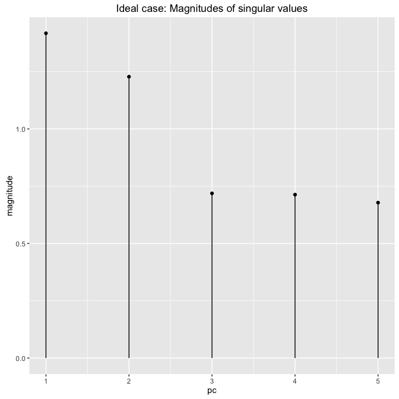
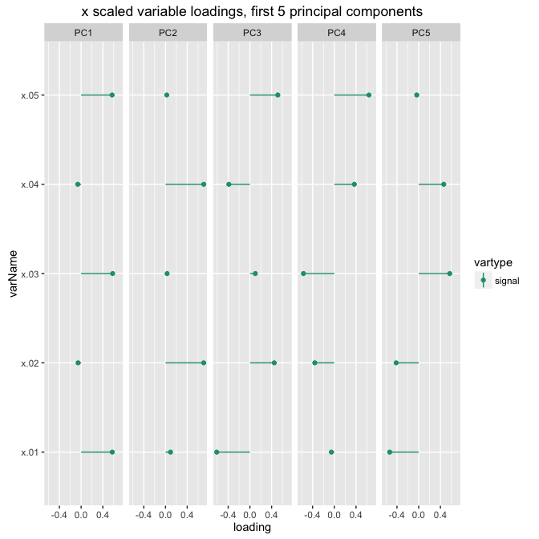
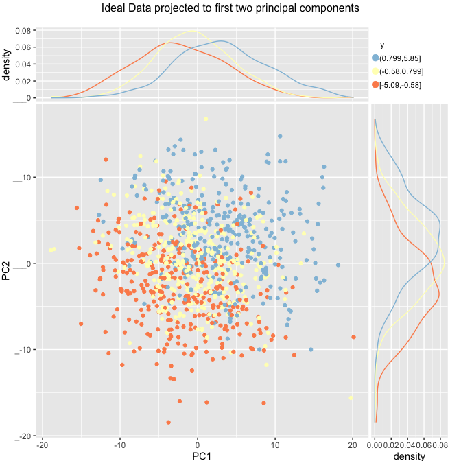
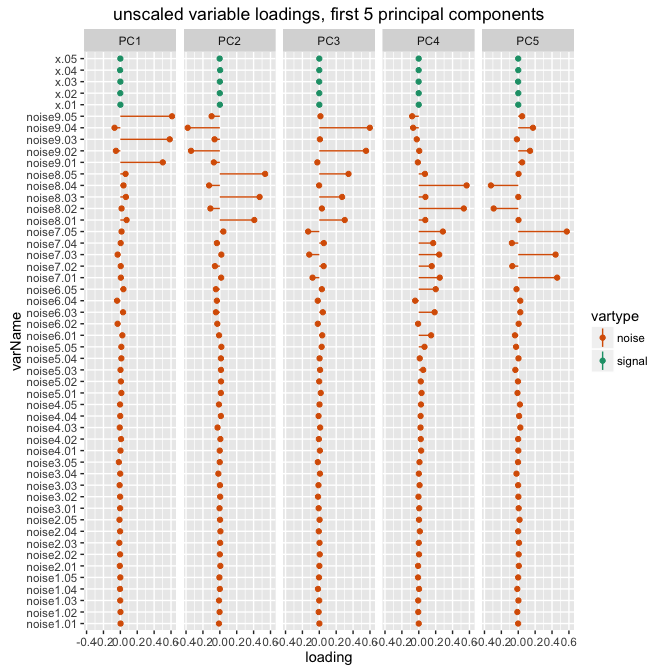
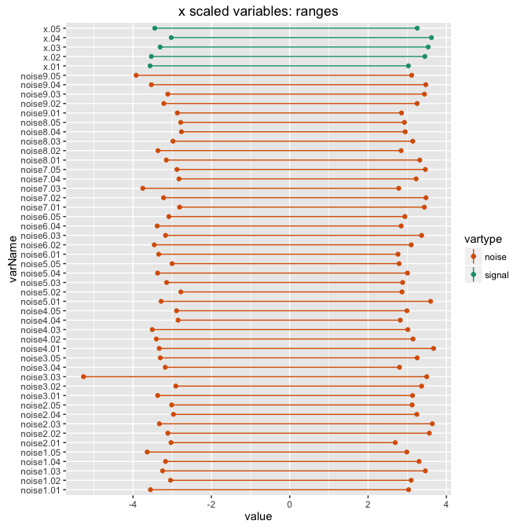
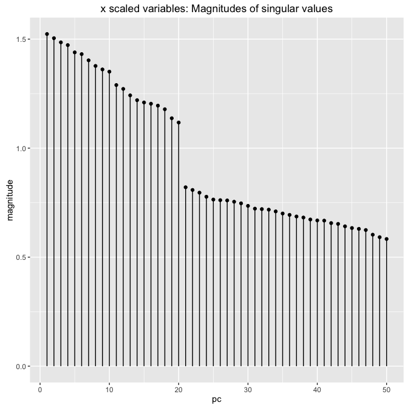
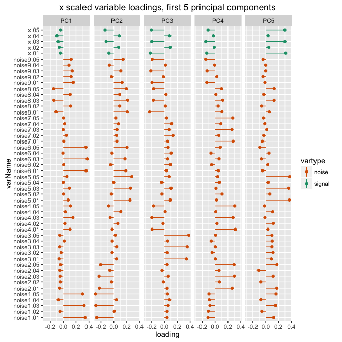
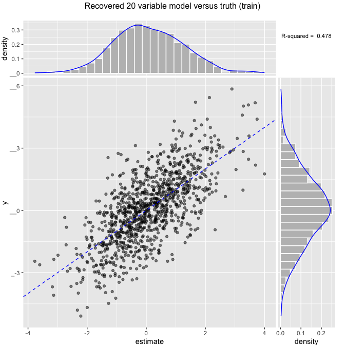
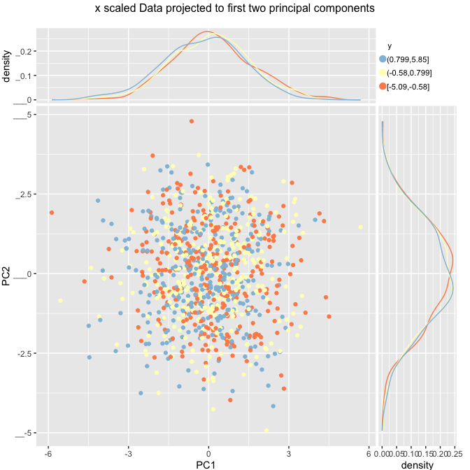

This article is by [Dr. Nina Zumel](http://www.win-vector.com/site/staff/nina-zumel/) of [Win-Vector LLC](http://www.win-vector.com/) and is hosted at: <http://www.win-vector.com/blog/2016/05/pcr_part1_xonly>.

In this note, we discuss principal components regression and some of the issues with it:

-   The need for scaling.
-   The need for pruning.
-   The lack of "*y*-awareness" of the standard dimensionality reduction step.

The purpose of this article is to set the stage for presenting dimensionality reduction techniques more appropriate for predictive modeling, such as *y*-aware principal components analysis, variable pruning, L2-regularized regression, supervised PCR, or partial least squares. We do this by working detailed examples and building the relevant graphs. In our follow-up article we describe and demonstrate the idea of *y*-aware scaling.

Note we will try to say "principal components" (plural) throughout, following Everitt's *The Cambridge Dictionary of Statistics*, though this is not the only common spelling (e.g. Wikipedia: [Principal component regression](https://en.wikipedia.org/wiki/Principal_component_regression)). We will work all of our examples in [R](https://cran.r-project.org/).

Principal Components Regression
-------------------------------

In principal components regression (PCR), we use principal components analysis (PCA) to decompose the independent (*x*) variables into an orthogonal basis (the principal components), and select a subset of those components as the variables to predict *y*. PCR and PCA are useful techniques for dimensionality reduction when modeling, and are especially useful when the independent variables are highly colinear.

Generally, one selects the principal components with the highest variance -- that is, the components with the largest singular values -- because the subspace defined by these principal components captures most of the variation in the data, and thus represents a smaller space that we believe captures most of the qualities of the data. Note, however, that standard PCA is an "*x*-only" decomposition, and as Jolliffe (1982) shows through examples from the literature, sometimes lower-variance components can be critical for predicting *y*, and conversely, high variance components are sometimes not important.

> Mosteller and Tukey (1977, pp. 397-398) argue similarly that the components with small variance are unlikely to be important in regression, apparently on the basis that nature is "tricky, but not downright mean". We shall see in the examples below that without too much effort we can find examples where nature is "downright mean". -- Jolliffe (1982)

The remainder of this note presents principal components analysis in the context of PCR and predictive modeling in general. We will show some of the issues in using an *x*-only technique like PCA for dimensionality reduction. In a follow-up note, we'll discuss some *y*-aware approaches that address these issues.

First, let's build our example. In this sort of teaching we insist on toy or synthetic problems so we actually *know* the right answer, and can therefore tell which procedures are better at modeling the truth.

In this data set, there are two (unobservable) processes: one that produces the output `yA` and one that produces the output `yB`. We only observe the mixture of the two: `y =  yA + yB + eps`, where `eps` is a noise term. Think of `y` as measuring some notion of success and the `x` variables as noisy estimates of two different factors that can each drive success. We'll set things up so that the first five variables (x.01, x.02, x.03, x.04, x.05) have all the signal. The odd numbered variables correspond to one process (`yB`) and the even numbered variables correspond to the other (`yA`).

Then, to simulate the difficulties of real world modeling, we'll add lots of pure noise variables (`noise*`). The noise variables are unrelated to our *y* of interest -- but are related to other "y-style" processes that we are not interested in. As is common with good statistical counterexamples, the example looks like something that should not happen or that can be easily avoided. Our point is that the data analyst is usually working with data just like this.

Data tends to come from databases that must support many different tasks, so it is exactly the case that there may be columns or variables that are correlated to unknown and unwanted additional processes. The reason PCA can't filter out these noise variables is that without use of *y*, standard PCA has no way of knowing *what* portion of the variation in each variable is important to the problem at hand and should be preserved. This *can* be fixed through domain knowledge (knowing which variables to use), variable pruning and *y*-aware scaling. Our next article will discuss these procedures; in this article we will orient ourselves with a demonstration of both what a good analysis and what a bad analysis looks like.

All the variables are also deliberately mis-scaled to model some of the difficulties of working with under-curated real world data.

``` r
# build example where even and odd variables are bringing in noisy images
# of two different signals.
mkData <- function(n) {
  for(group in 1:10) {
    # y is the sum of two effects yA and yB
    yA <- rnorm(n)
    yB <- rnorm(n)
    if(group==1) {
      d <- data.frame(y=yA+yB+rnorm(n))
      code <- 'x'
    } else {
      code <- paste0('noise',group-1)
    }
    yS <- list(yA,yB)
    # these variables are correlated with y in group 1,
    # but only to each other (and not y) in other groups
    for(i in 1:5) {
      vi <- yS[[1+(i%%2)]] + rnorm(nrow(d))
      d[[paste(code,formatC(i,width=2,flag=0),sep='.')]] <- ncol(d)*vi
    }
  }
  d
}
```

Notice the copy of *y* in the data frame has additional "unexplainable variance" so only about 66% of the variation in *y* is predictable.

Let's start with our train and test data.

``` r
# make data
set.seed(23525)
dTrain <- mkData(1000)
dTest <- mkData(1000)
```

Let's look at our outcome *y* and a few of our variables.

``` r
summary(dTrain[, c("y", "x.01", "x.02",
                   "noise1.01", "noise1.02")])
```

    ##        y                 x.01               x.02        
    ##  Min.   :-5.08978   Min.   :-4.94531   Min.   :-9.9796  
    ##  1st Qu.:-1.01488   1st Qu.:-0.97409   1st Qu.:-1.8235  
    ##  Median : 0.08223   Median : 0.04962   Median : 0.2025  
    ##  Mean   : 0.08504   Mean   : 0.02968   Mean   : 0.1406  
    ##  3rd Qu.: 1.17766   3rd Qu.: 0.93307   3rd Qu.: 1.9949  
    ##  Max.   : 5.84932   Max.   : 4.25777   Max.   :10.0261  
    ##    noise1.01          noise1.02       
    ##  Min.   :-30.5661   Min.   :-30.4412  
    ##  1st Qu.: -5.6814   1st Qu.: -6.4069  
    ##  Median :  0.5278   Median :  0.3031  
    ##  Mean   :  0.1754   Mean   :  0.4145  
    ##  3rd Qu.:  5.9238   3rd Qu.:  6.8142  
    ##  Max.   : 26.4111   Max.   : 31.8405

Usually we recommend doing some significance pruning on variables before moving on -- see [here](http://www.win-vector.com/blog/2014/02/bad-bayes-an-example-of-why-you-need-hold-out-testing/) for possible consequences of not pruning an over-abundance of variables, and [here](http://www.win-vector.com/blog/2015/08/how-do-you-know-if-your-data-has-signal/) for a discussion of one way to prune, based on significance. For this example, however, we will deliberately attempt dimensionality reduction without pruning (to demonstrate the problem). Part of what we are trying to show is to *not* assume PCA performs these steps for you.

Ideal situation
---------------

First, let's look at the ideal situation. If we had sufficient domain knowledge (or had performed significance pruning) to remove the noise, we would have no pure noise variables. In our example we know which variables carry signal and therefore can limit down to them before doing the PCA as follows.

``` r
goodVars <-  colnames(dTrain)[grep('^x.',colnames(dTrain))]
dTrainIdeal <- dTrain[,c('y',goodVars)]
dTestIdeal <-  dTrain[,c('y',goodVars)]
```

Let's perform the analysis and look at the magnitude of the singular values.

``` r
# do the PCA
dmTrainIdeal <- as.matrix(dTrainIdeal[,goodVars])
princIdeal <- prcomp(dmTrainIdeal,center = TRUE,scale. = TRUE)

# extract the principal components
rot5Ideal <- extractProjection(5,princIdeal)

# prepare the data to plot the variable loadings
rotfIdeal = as.data.frame(rot5Ideal)
rotfIdeal$varName = rownames(rotfIdeal)
rotflongIdeal = gather(rotfIdeal, "PC", "loading",
                       starts_with("PC"))
rotflongIdeal$vartype = ifelse(grepl("noise", 
                                     rotflongIdeal$varName),
                               "noise", "signal")

# plot the singular values
dotplot_identity(frame = data.frame(pc=1:length(princIdeal$sdev), 
                            magnitude=princIdeal$sdev), 
                 xvar="pc",yvar="magnitude") +
  ggtitle("Ideal case: Magnitudes of singular values")
```



The magnitudes of the singular values tell us that the first two principal components carry most of the signal. We can also look at the variable loadings of the principal components. The plot of the variable loadings is a graphical representation of the coordinates of the principal components. Each coordinate corresponds to the contribution of one of the original variables to that principal component.

``` r
dotplot_identity(rotflongIdeal, "varName", "loading", "vartype") + 
  facet_wrap(~PC,nrow=1) + coord_flip() + 
  ggtitle("x scaled variable loadings, first 5 principal components") + 
  scale_color_manual(values = c("noise" = "#d95f02", "signal" = "#1b9e77"))
```



We see that we recover the even/odd loadings of the original signal variables. `PC1` has the odd variables, and `PC2` has the even variables. The next three principal components complete the basis for the five original variables.

Since most of the signal is in the first two principal components, we can look at the projection of the data into that plane, using color to code *y*.

``` r
# signs are arbitrary on PCA, so instead of calling predict we pull out
# (and alter) the projection by hand
projectedTrainIdeal <-
  as.data.frame(dmTrainIdeal %*% extractProjection(2,princIdeal),
                                 stringsAsFactors = FALSE)
projectedTrainIdeal$y <- dTrain$y
ScatterHistN(projectedTrainIdeal,'PC1','PC2','y',
               "Ideal Data projected to first two principal components")
```



Notice that the value of *y* increases both as we move up and as we move right. We have recovered two orthogonal features that each correlate with an increase in y (in general the signs of the principal components -- that is, which direction is "positive" -- are arbitrary, so without precautions the above graph can appear flipped). Recall that we constructed the data so that the odd variables (represented by `PC1`) correspond to process *yB* and the even variables (represented by `PC2`) correspond to process *yA*. We have recovered both of these relations in the figure.

This is why you rely on domain knowledge, or barring that, at least prune your variables. For this example variable pruning would have gotten us to the above ideal case. In our next article we will show how to perform the significance pruning.

*X*-only PCA
------------

To demonstrate the problem of *x*-only PCA on unpruned data in a predictive modeling situation, let's analyze the same data without limiting ourselves to the known good variables. We are pretending (as is often the case) we don't have the domain knowledge indicating which variables are useful *and* we have neglected to significance prune the variables before PCA. In our experience, this is a common mistake in using PCR, or, more generally, with using PCA in predictive modeling situations.

This example will demonstrate how you lose modeling power when you don't apply the methods in a manner appropriate to your problem. Note that the appropriate method for your data may not match the doctrine of another field, as they may have different data issues.

### The wrong way: PCA without any scaling

We deliberately mis-scaled the original data when we generated it. Mis-scaled data is a common problem in data science situations, but perhaps less common in carefully curated scientific situations. In a messy data situation like the one we are emulating, the best practice is to re-scale the *x* variables; however, we'll first naively apply PCA to the data as it is. This is to demonstrate the sensitivity of PCA to the units of the data.

``` r
vars <- setdiff(colnames(dTrain),'y')

duTrain <- as.matrix(dTrain[,vars])
prinU <- prcomp(duTrain,center = TRUE,scale. = FALSE) 

dotplot_identity(frame = data.frame(pc=1:length(prinU$sdev), 
                            magnitude=prinU$sdev), 
                 xvar="pc",yvar="magnitude") +
  ggtitle("Unscaled case: Magnitudes of singular values")
```


There is no obvious knee in the magnitudes of the singular values, so we are at a loss as to how many variables we should use. In addition, when we look at the variable loading of the first five principal components, we will see another problem:

``` r
rot5U <- extractProjection(5,prinU)
rot5U = as.data.frame(rot5U)
rot5U$varName = rownames(rot5U)
rot5U = gather(rot5U, "PC", "loading",
                       starts_with("PC"))
rot5U$vartype = ifelse(grepl("noise", 
                                     rot5U$varName),
                               "noise", "signal")

dotplot_identity(rot5U, "varName", "loading", "vartype") + 
  facet_wrap(~PC,nrow=1) + coord_flip() + 
  ggtitle("unscaled variable loadings, first 5 principal components") + 
  scale_color_manual(values = c("noise" = "#d95f02", "signal" = "#1b9e77"))
```



The noise variables completely dominate the loading of the first several principal components. Because of the way we deliberately mis-scaled the data, the noise variables are of much larger magnitude than the signal variables, and so the true signal is masked when we decompose the data.

Since the magnitudes of the singular values don't really give us a clue as to how many components to use in our model, let's try using all of them. This actually makes no sense, because using all the principal components is equivalent to using all the variables, thus defeating the whole purpose of doing PCA in the first place. But let's do it anyway (as many unwittingly do).

``` r
# get all the principal components
# not really a projection as we took all components!
projectedTrain <- as.data.frame(predict(prinU,duTrain),
                                 stringsAsFactors = FALSE)
vars = colnames(projectedTrain)
projectedTrain$y <- dTrain$y

varexpr = paste(vars, collapse="+")
fmla = paste("y ~", varexpr)

model <- lm(fmla,data=projectedTrain)
summary(model)
```

    ## 
    ## Call:
    ## lm(formula = fmla, data = projectedTrain)
    ## 
    ## Residuals:
    ##     Min      1Q  Median      3Q     Max 
    ## -3.1748 -0.7611  0.0111  0.7821  3.6559 
    ## 
    ## Coefficients:
    ##               Estimate Std. Error t value Pr(>|t|)    
    ## (Intercept)  8.504e-02  3.894e-02   2.184 0.029204 *  
    ## PC1          1.492e-04  4.131e-04   0.361 0.717983    
    ## PC2          1.465e-05  4.458e-04   0.033 0.973793    
    ## PC3         -7.372e-04  4.681e-04  -1.575 0.115648    
    ## PC4          6.894e-04  5.211e-04   1.323 0.186171    
    ## PC5          7.529e-04  5.387e-04   1.398 0.162577    
    ## PC6         -2.382e-04  5.961e-04  -0.400 0.689612    
    ## PC7          2.555e-04  6.142e-04   0.416 0.677546    
    ## PC8          5.850e-04  6.701e-04   0.873 0.382908    
    ## PC9         -6.890e-04  6.955e-04  -0.991 0.322102    
    ## PC10         7.472e-04  7.650e-04   0.977 0.328993    
    ## PC11        -7.034e-04  7.839e-04  -0.897 0.369763    
    ## PC12         7.062e-04  8.039e-04   0.878 0.379900    
    ## PC13         1.098e-04  8.125e-04   0.135 0.892511    
    ## PC14        -8.137e-04  8.405e-04  -0.968 0.333213    
    ## PC15        -5.163e-05  8.716e-04  -0.059 0.952776    
    ## PC16         1.945e-03  9.015e-04   2.158 0.031193 *  
    ## PC17        -3.384e-04  9.548e-04  -0.354 0.723143    
    ## PC18        -9.339e-04  9.774e-04  -0.955 0.339587    
    ## PC19        -6.110e-04  1.005e-03  -0.608 0.543413    
    ## PC20         8.747e-04  1.042e-03   0.839 0.401494    
    ## PC21         4.538e-04  1.083e-03   0.419 0.675310    
    ## PC22         4.237e-04  1.086e-03   0.390 0.696428    
    ## PC23        -2.011e-03  1.187e-03  -1.694 0.090590 .  
    ## PC24         3.451e-04  1.204e-03   0.287 0.774416    
    ## PC25         2.156e-03  1.263e-03   1.707 0.088183 .  
    ## PC26        -6.293e-04  1.314e-03  -0.479 0.631988    
    ## PC27         8.401e-04  1.364e-03   0.616 0.538153    
    ## PC28        -2.578e-03  1.374e-03  -1.876 0.061014 .  
    ## PC29         4.354e-04  1.423e-03   0.306 0.759691    
    ## PC30         4.098e-04  1.520e-03   0.270 0.787554    
    ## PC31         5.509e-03  1.650e-03   3.339 0.000875 ***
    ## PC32         9.097e-04  1.750e-03   0.520 0.603227    
    ## PC33         5.617e-04  1.792e-03   0.314 0.753964    
    ## PC34        -1.247e-04  1.870e-03  -0.067 0.946837    
    ## PC35        -6.470e-04  2.055e-03  -0.315 0.752951    
    ## PC36         1.435e-03  2.218e-03   0.647 0.517887    
    ## PC37         4.906e-04  2.246e-03   0.218 0.827168    
    ## PC38        -2.915e-03  2.350e-03  -1.240 0.215159    
    ## PC39        -1.917e-03  2.799e-03  -0.685 0.493703    
    ## PC40         4.827e-04  2.820e-03   0.171 0.864117    
    ## PC41        -6.016e-05  3.060e-03  -0.020 0.984321    
    ## PC42         6.750e-03  3.446e-03   1.959 0.050425 .  
    ## PC43        -3.537e-03  4.365e-03  -0.810 0.417996    
    ## PC44        -4.845e-03  5.108e-03  -0.948 0.343131    
    ## PC45         8.643e-02  5.456e-03  15.842  < 2e-16 ***
    ## PC46         7.882e-02  6.267e-03  12.577  < 2e-16 ***
    ## PC47         1.202e-01  6.693e-03  17.965  < 2e-16 ***
    ## PC48        -9.042e-02  1.163e-02  -7.778 1.92e-14 ***
    ## PC49         1.309e-01  1.670e-02   7.837 1.23e-14 ***
    ## PC50         2.893e-01  3.546e-02   8.157 1.08e-15 ***
    ## ---
    ## Signif. codes:  0 '***' 0.001 '**' 0.01 '*' 0.05 '.' 0.1 ' ' 1
    ## 
    ## Residual standard error: 1.231 on 949 degrees of freedom
    ## Multiple R-squared:  0.5052, Adjusted R-squared:  0.4791 
    ## F-statistic: 19.38 on 50 and 949 DF,  p-value: < 2.2e-16

``` r
estimate <- predict(model,newdata=projectedTrain)
trainrsq <- rsq(estimate,projectedTrain$y)
```

Note that most of the variables that achieve significance are the very last ones! We will leave it to the reader to confirm that using even as many as the first 25 principal components -- half the variables -- explains little of the variation in *y*. If we wanted to use PCR to reduce the dimensionality of the problem, we have failed. This is an example of what Jolliffe would have called a "downright mean" modeling problem, which we caused by mis-scaling the data. Note the r-squared of 0.5052 for comparison, later.

So now let's do what we should have done in the first place: scale the data.

### A better way: Preparing the training data with *x*-only scaling

Standard practice is to center the data at mean zero and scale it to unit standard deviation, which is easy with the `scale` command.

``` r
dTrainNTreatedUnscaled <- dTrain
dTestNTreatedUnscaled <- dTest

# scale the data
dTrainNTreatedXscaled <- 
  as.data.frame(scale(dTrainNTreatedUnscaled[,colnames(dTrainNTreatedUnscaled)!='y'],
                      center=TRUE,scale=TRUE),stringsAsFactors = FALSE)
dTrainNTreatedXscaled$y <- dTrainNTreatedUnscaled$y
dTestNTreatedXscaled <- 
  as.data.frame(scale(dTestNTreatedUnscaled[,colnames(dTestNTreatedUnscaled)!='y'],
                      center=TRUE,scale=TRUE),stringsAsFactors = FALSE)
dTestNTreatedXscaled$y <- dTestNTreatedUnscaled$y

# get the variable ranges
ranges = vapply(dTrainNTreatedXscaled, FUN=function(col) c(min(col), max(col)), numeric(2))
rownames(ranges) = c("vmin", "vmax") 
rframe = as.data.frame(t(ranges))  # make ymin/ymax the columns
rframe$varName = rownames(rframe)
varnames = setdiff(rownames(rframe), "y")
rframe = rframe[varnames,]
rframe$vartype = ifelse(grepl("noise", rframe$varName),
                        "noise", "signal")

summary(dTrainNTreatedXscaled[, c("y", "x.01", "x.02", 
                                  "noise1.01", "noise1.02")])
```

    ##        y                 x.01               x.02         
    ##  Min.   :-5.08978   Min.   :-3.56466   Min.   :-3.53178  
    ##  1st Qu.:-1.01488   1st Qu.:-0.71922   1st Qu.:-0.68546  
    ##  Median : 0.08223   Median : 0.01428   Median : 0.02157  
    ##  Mean   : 0.08504   Mean   : 0.00000   Mean   : 0.00000  
    ##  3rd Qu.: 1.17766   3rd Qu.: 0.64729   3rd Qu.: 0.64710  
    ##  Max.   : 5.84932   Max.   : 3.02949   Max.   : 3.44983  
    ##    noise1.01          noise1.02       
    ##  Min.   :-3.55505   Min.   :-3.04344  
    ##  1st Qu.:-0.67730   1st Qu.:-0.67283  
    ##  Median : 0.04075   Median :-0.01098  
    ##  Mean   : 0.00000   Mean   : 0.00000  
    ##  3rd Qu.: 0.66476   3rd Qu.: 0.63123  
    ##  Max.   : 3.03398   Max.   : 3.09969

``` r
barbell_plot(rframe, "varName", "vmin", "vmax", "vartype") +
  coord_flip() + ggtitle("x scaled variables: ranges") + 
  scale_color_manual(values = c("noise" = "#d95f02", "signal" = "#1b9e77"))
```



Note that the signal and noise variables now have commensurate ranges.

### The principal components analysis

``` r
vars = setdiff(colnames(dTrainNTreatedXscaled), "y")

dmTrain <- as.matrix(dTrainNTreatedXscaled[,vars])
dmTest <- as.matrix(dTestNTreatedXscaled[,vars])
princ <- prcomp(dmTrain,center = TRUE,scale. = TRUE) 
dotplot_identity(frame = data.frame(pc=1:length(princ$sdev), 
                            magnitude=princ$sdev), 
                 xvar="pc",yvar="magnitude") +
  ggtitle("x scaled variables: Magnitudes of singular values")
```



``` r
sum(princ$sdev^2)
```

    ## [1] 50

Now the magnitudes of the singular values suggest that we can try to model the data with only the first twenty principal components. But first, let's look at the variable loadings of the first five principal components.

``` r
rot5 <- extractProjection(5,princ)
rotf = as.data.frame(rot5)
rotf$varName = rownames(rotf)
rotflong = gather(rotf, "PC", "loading", starts_with("PC"))
rotflong$vartype = ifelse(grepl("noise", rotflong$varName), 
                          "noise", "signal")

dotplot_identity(rotflong, "varName", "loading", "vartype") + 
  facet_wrap(~PC,nrow=1) + coord_flip() + 
  ggtitle("x scaled variable loadings, first 5 principal components") + 
  scale_color_manual(values = c("noise" = "#d95f02", "signal" = "#1b9e77"))
```



The signal variables now have larger loadings than they did in the unscaled case, but the noise variables still dominate the projection, in aggregate swamping out the contributions from the signal variables. The two processes that produced *y* have diffused amongst the principal components, rather than mostly concentrating in the first two, as they did in the ideal case. This is because we constructed the noise variables to have variation and some correlations with each other -- but not be correlated with *y*. PCA doesn't know that we are interested only in variable correlations that are due to *y*, so it must decompose the data to capture as much variation, and as many variable correlations, as possible.

In other words, PCA must represent all processes present in the data, regardless of whether we are trying to predict those particular processes or not. Without the knowledge of the *y* that we are trying to predict, PCA is forced to prepare for *any* possible future prediction task.

#### Modeling

Let's build a model using only the first twenty principal components, as our above analysis suggests we should.

``` r
# get all the principal components
# not really a projection as we took all components!
projectedTrain <- as.data.frame(predict(princ,dmTrain),
                                 stringsAsFactors = FALSE)
projectedTrain$y <- dTrainNTreatedXscaled$y

ncomp = 20
# here we will only model with the first ncomp principal components
varexpr = paste(paste("PC", 1:ncomp, sep=''), collapse='+')
fmla = paste("y ~", varexpr)

model <- lm(fmla,data=projectedTrain)
summary(model)
```

    ## 
    ## Call:
    ## lm(formula = fmla, data = projectedTrain)
    ## 
    ## Residuals:
    ##     Min      1Q  Median      3Q     Max 
    ## -3.2612 -0.7939 -0.0096  0.7898  3.8352 
    ## 
    ## Coefficients:
    ##              Estimate Std. Error t value Pr(>|t|)    
    ## (Intercept)  0.085043   0.039391   2.159 0.031097 *  
    ## PC1          0.107016   0.025869   4.137 3.82e-05 ***
    ## PC2         -0.047934   0.026198  -1.830 0.067597 .  
    ## PC3          0.135933   0.026534   5.123 3.62e-07 ***
    ## PC4         -0.162336   0.026761  -6.066 1.87e-09 ***
    ## PC5          0.356880   0.027381  13.034  < 2e-16 ***
    ## PC6         -0.126491   0.027534  -4.594 4.92e-06 ***
    ## PC7          0.092546   0.028093   3.294 0.001022 ** 
    ## PC8         -0.134252   0.028619  -4.691 3.11e-06 ***
    ## PC9          0.280126   0.028956   9.674  < 2e-16 ***
    ## PC10        -0.112623   0.029174  -3.860 0.000121 ***
    ## PC11        -0.065812   0.030564  -2.153 0.031542 *  
    ## PC12         0.339129   0.030989  10.943  < 2e-16 ***
    ## PC13        -0.006817   0.031727  -0.215 0.829918    
    ## PC14         0.086316   0.032302   2.672 0.007661 ** 
    ## PC15        -0.064822   0.032582  -1.989 0.046926 *  
    ## PC16         0.300566   0.032739   9.181  < 2e-16 ***
    ## PC17        -0.339827   0.032979 -10.304  < 2e-16 ***
    ## PC18        -0.287752   0.033443  -8.604  < 2e-16 ***
    ## PC19         0.297290   0.034657   8.578  < 2e-16 ***
    ## PC20         0.084198   0.035265   2.388 0.017149 *  
    ## ---
    ## Signif. codes:  0 '***' 0.001 '**' 0.01 '*' 0.05 '.' 0.1 ' ' 1
    ## 
    ## Residual standard error: 1.246 on 979 degrees of freedom
    ## Multiple R-squared:  0.4776, Adjusted R-squared:  0.467 
    ## F-statistic: 44.76 on 20 and 979 DF,  p-value: < 2.2e-16

``` r
projectedTrain$estimate <- predict(model,newdata=projectedTrain)
ScatterHist(projectedTrain,'estimate','y','Recovered 20 variable model versus truth (train)',
            smoothmethod='identity',annot_size=3)
```



``` r
trainrsq <- rsq(projectedTrain$estimate,projectedTrain$y)
```

This model explains 47.76% of the variation in the training set. We do about as well on test.

``` r
projectedTest <- as.data.frame(predict(princ,dmTest),
                                 stringsAsFactors = FALSE)
projectedTest$y <- dTestNTreatedXscaled$y
projectedTest$estimate <- predict(model,newdata=projectedTest)
testrsq <- rsq(projectedTest$estimate,projectedTest$y)
testrsq
```

    ## [1] 0.5033022

This is pretty good; recall that we had about 33% unexplainable variance in the data, so we would not expect any modeling algorithm to get better than an r-squared of about 0.67.

We can confirm that this performance is as good as simply regressing on all the variables without the PCA, so we have at least not lost information via our dimensionality reduction.

``` r
# fit a model to the original data
vars <- setdiff(colnames(dTrain),'y')
formulaB <- paste('y',paste(vars,collapse=' + '),sep=' ~ ')
modelB <- lm(formulaB,data=dTrain)
dTrainestimate <- predict(modelB,newdata=dTrain)
rsq(dTrainestimate,dTrain$y)
```

    ## [1] 0.5052081

``` r
dTestestimate <- predict(modelB,newdata=dTest)
rsq(dTestestimate,dTest$y)
```

    ## [1] 0.4751995

We will show in our next article how to get a similar test r-squared from this data using a model with only two variables.

### Are we done?

Scaling the variables improves the performance of PCR on this data relative to not scaling, but we haven't completely solved the problem (though some analysts are fooled into thinking thusly). We have not explicitly recovered the two processes that drive *y*, and recovering such structure in the data is one of the purposes of PCA -- if we did not care about the underlying structure of the problem, we could simply fit a model to the original data, or use other methods (like significance pruning) to reduce the problem dimensionality.

It is a misconception in some fields that the variables must be orthogonal before fitting a linear regression model. This is *not* true. A linear model fit to collinear variables can still predict well; the only downside is that the coefficients of the model are not necessarily as easily interpretable as they are when the variables are orthogonal (and ideally, centered and scaled, as well). If your data has so much collinearity that the design matrix is ill-conditioned, causing the model coefficients to be inappropriately large or unstable, then regularization (ridge, lasso, or elastic-net regression) is a good solution. More complex predictive modeling approaches, for example random forest or gradient boosting, also tend to be more immune to collinearity.

So if you are doing PCR, you presumably are interested in the underlying structure of the data, and in this case, we haven't found it. Projecting onto the first few principal components fails to show much of a relation between these components and *y*.

We can confirm the first two *x*-scaled principal components are not informative with the following graph.

``` r
proj <- extractProjection(2,princ)
# apply projection
projectedTrain <- as.data.frame(dmTrain %*% proj,
                      stringsAsFactors = FALSE)
projectedTrain$y <- dTrainNTreatedXscaled$y
# plot data sorted by principal components
ScatterHistN(projectedTrain,'PC1','PC2','y',
               "x scaled Data projected to first two principal components")
```



We see that *y* is not well ordered by `PC1` and `PC2` here, as it was in the ideal case, and as it will be with the *y*-aware PCA.

In our next article we will show that we can explain almost 50% of the *y* variance in this data using only two variables. This is quite good as even the "all variable" model only picks up about that much of the relation and *y* by design has about 33% unexplainable variation. In addition to showing the standard methods (including variable pruning) we will introduce a technique we call "*y*-aware scaling."

Click [here](http://www.win-vector.com/blog/2016/05/pcr_part2_yaware) for part 2 (*y*-aware methods).

### References

Everitt, B. S. *The Cambridge Dictionary of Statistics*, 2nd edition, Cambridge University Press, 2005.

Jolliffe, Ian T. "A Note on the Use of Principal Components in Regression," *Journal of the Royal Statistical Society. Series C (Applied Statistics)*, Vol. 31, No. 3 (1982), pp. 300-303
