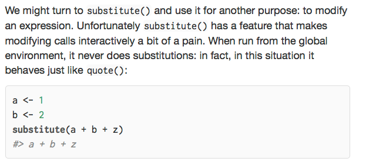

<!-- *.md is generated from *.Rmd. Please edit that file -->
Let's worry a bit about substitution in [`R`](https://cran.r-project.org). Substitution is very powerful, which means it can be both used and mis-used. However, that does not mean every use is unsafe or a mistake.

From [*Advanced R* : substitute](http://adv-r.had.co.nz/Computing-on-the-language.html#substitute):



We can confirm the above code performs no substitution:

``` r
a <- 1
b <- 2
substitute(a + b + z)
```

    ## a + b + z

And it appears the effect is that substitute is designed to not take values from the global environment. So, as we see below, it isn't so much what environment we are running in that changes substitute's behavior, it is what environment the values are bound to that changes things.

``` r
(function() {
  a <- 1
  substitute(a + b + z, 
             environment())
})()
```

    ## 1 + b + z

We can in fact find many simple variations of substitute that work conveniently.

``` r
substitute(a + b + z, 
           list(a=1, b=2))
```

    ## 1 + 2 + z

``` r
substitute(a + b + z, 
           as.list(environment()))
```

    ## 1 + 2 + z

Often `R`'s documentation is a bit terse (or even incomplete) and functions (confusingly) change behavior based on type of arguments and context. I say: always try a few variations to see if some simple alteration can make "base-R" work for you before giving up and delegating everything to an add-on package.

However, we in fact found could not use `substitute()` to implement [`wrapr::let()`](https://CRAN.R-project.org/package=wrapr) effects (that is re-mapping non-standard interfaces to [parametric interfaces](http://www.win-vector.com/blog/2016/12/parametric-variable-names-and-dplyr/)). There were some avoidable difficulties regarding quoting and un-quoting of expressions. But the killing issue was: `substitute()` apparently does not re-map left-hand sides:

``` r
# function that print all of its arguments (including bindings)
f <- function(...) {
  args <- match.call()
  print(paste("f() call is:", capture.output(str(args))))
}

# set up some global variables
X <- 2
B <- 5

# try it
f(X=7, Y=X)
```

    ## [1] "f() call is:  language f(X = 7, Y = X)"

``` r
# use substitute to capture an expression
captured <- substitute(f(X=7, Y=X))
# print the captured expression
print(captured)
```

    ## f(X = 7, Y = X)

``` r
# evaluate the captured expression
eval(captured)
```

    ## [1] "f() call is:  language f(X = 7, Y = X)"

``` r
# notice above by the time we get into the function 
# the function arguments have taken there value first
# from explicit argument assignment (X=7) and then from
# the calling environment (Y=X goes to 2).

# now try to use substitute() to re-map values
xform1 <- substitute(captured, 
                     list(X= as.name('B')))
# doesn't look good in printing
print(xform1)
```

    ## captured

``` r
# and substitutions did not happen as the variables we
# are trying to alter are not free in the word "captured"
# (they are in the expression the name captured is referring to)
eval(xform1)
```

    ## f(X = 7, Y = X)

``` r
# can almost fix that by calling substitute on the value
# of captured (not the word "captured") with do.call()
subs <- do.call(substitute, 
                list(captured,  list(X= as.name('B'))))
print(subs)
```

    ## f(X = 7, Y = B)

``` r
eval(subs)
```

    ## [1] "f() call is:  language f(X = 7, Y = B)"

``` r
# notice however, only right hand side was re-mapped
# we saw "f(X = 7, Y = B)", not "f(B = 7, Y = B)"
# for some packages (such as dplyr) re-mapping
# left-hand sides is important
# this is why wrapr::let() exists

wrapr::let(
  c(X= 'B'),
  f(X=7, Y=X)
)
```

    ## [1] "f() call is:  language f(B = 7, Y = B)"

``` r
suppressPackageStartupMessages(library("dplyr"))

d <- data.frame(x = 1:3)
mapping <- c(OLDCOL= 'x',
             NEWCOL= 'y')
wrapr::let(
  mapping,
  d %>%
    mutate(NEWCOL = OLDCOL*OLDCOL)
)
```

    ##   x y
    ## 1 1 1
    ## 2 2 4
    ## 3 3 9

`wrapr::let()` is based on string substitution. This is considered risky. Consider `help(substitute, package='base')`

> Note
>
> substitute works on a purely lexical basis. There is no guarantee that the resulting expression makes any sense.

And that is why `wrapr::let()` takes a [*large* number of precautions](http://www.win-vector.com/blog/2017/06/in-defense-of-wraprlet/#comment-66548) and vets user input before performing any substitution.

The idea is: `wrapr::let()` is more specialized than `base::summarize()` so in addition to attempting extra effects (re-mapping left hand sides) in can introduce a lot of checks to ensure safe invariants.

And that is a bit of my point: when moving to a package look for specificity and safety in addition to "extra power." That is how `wrapr::let()` is designed and whey `wrapr::let()` is a safe an effective package to add to your production work-flows.
