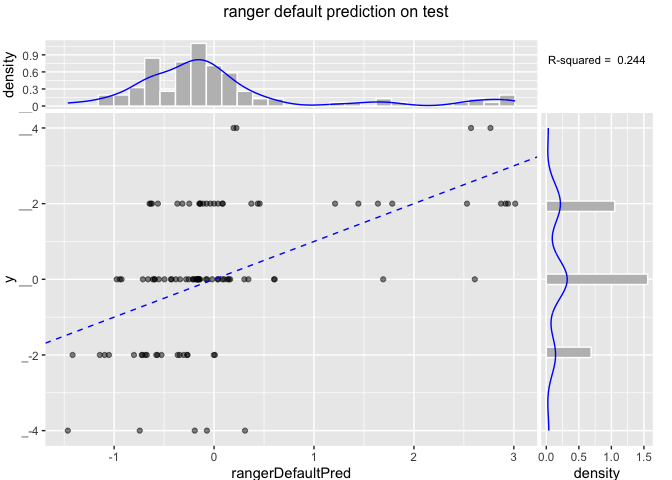
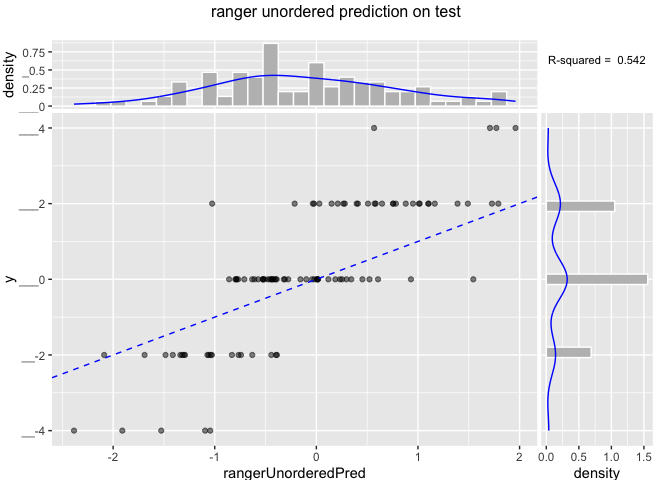
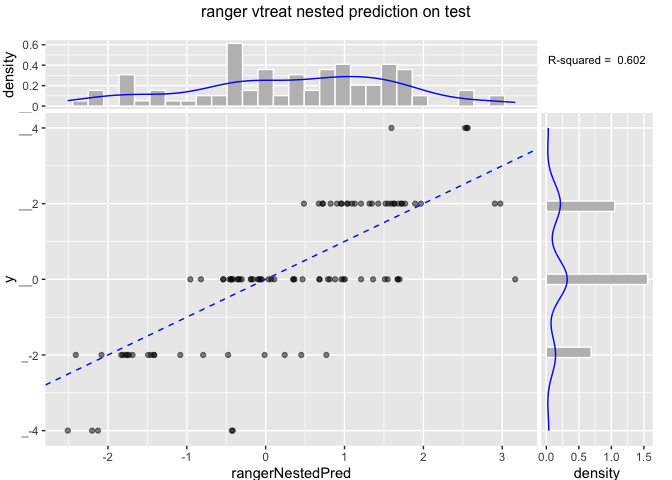
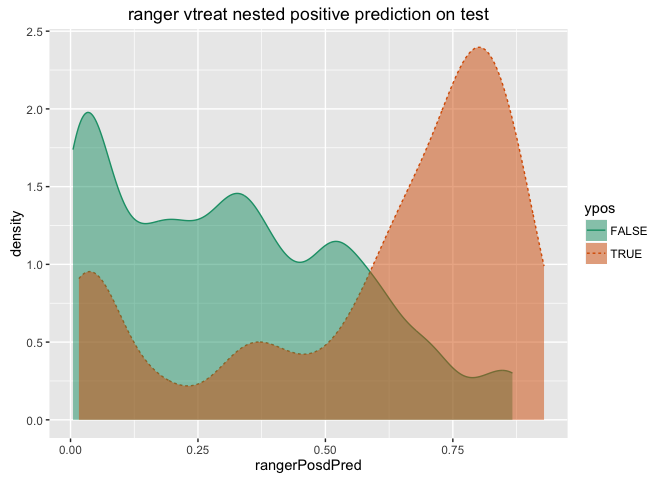

``` r
print(head(dTrain))
```

    ##          x1      x2      x3      x4 y
    ## 77  lev_008 lev_004 lev_007 lev_011 0
    ## 41  lev_016 lev_015 lev_019 lev_012 0
    ## 158 lev_007 lev_019 lev_001 lev_015 4
    ## 69  lev_010 lev_017 lev_018 lev_009 0
    ## 6   lev_003 lev_014 lev_016 lev_017 0
    ## 18  lev_004 lev_015 lev_014 lev_007 0

``` r
# default ranger model, treat categoricals as ordered (a very limiting treatment)
m1 <- ranger(y~x1+x2+x3+x4,data=dTrain, write.forest=TRUE)
print(m1)
```

    ## Ranger result
    ## 
    ## Call:
    ##  ranger(y ~ x1 + x2 + x3 + x4, data = dTrain, write.forest = TRUE) 
    ## 
    ## Type:                             Regression 
    ## Number of trees:                  500 
    ## Sample size:                      100 
    ## Number of independent variables:  4 
    ## Mtry:                             2 
    ## Target node size:                 5 
    ## Variable importance mode:         none 
    ## OOB prediction error:             3.880332 
    ## R squared:                        0.01640494

``` r
dTest$rangerDefaultPred <- predict(m1,data=dTest)$predictions
WVPlots::ScatterHist(dTest,'rangerDefaultPred','y',
                     'ranger default prediction on test',
                     smoothmethod='identity',annot_size=3)
```



``` r
# default ranger model, set categoricals to unordered, now limited to 63 levels
m2 <- ranger(y~x1+x2+x3+x4,data=dTrain,  write.forest=TRUE,
             respect.unordered.factors=TRUE)
```

    ## Growing trees.. Progress: 12%. Estimated remaining time: 3 minutes, 56 seconds.
    ## Growing trees.. Progress: 24%. Estimated remaining time: 3 minutes, 20 seconds.
    ## Growing trees.. Progress: 36%. Estimated remaining time: 2 minutes, 44 seconds.
    ## Growing trees.. Progress: 49%. Estimated remaining time: 2 minutes, 10 seconds.
    ## Growing trees.. Progress: 61%. Estimated remaining time: 1 minute, 38 seconds.
    ## Growing trees.. Progress: 74%. Estimated remaining time: 1 minute, 6 seconds.
    ## Growing trees.. Progress: 86%. Estimated remaining time: 36 seconds.
    ## Growing trees.. Progress: 98%. Estimated remaining time: 4 seconds.

``` r
print(m2)
```

    ## Ranger result
    ## 
    ## Call:
    ##  ranger(y ~ x1 + x2 + x3 + x4, data = dTrain, write.forest = TRUE,      respect.unordered.factors = TRUE) 
    ## 
    ## Type:                             Regression 
    ## Number of trees:                  500 
    ## Sample size:                      100 
    ## Number of independent variables:  4 
    ## Mtry:                             2 
    ## Target node size:                 5 
    ## Variable importance mode:         none 
    ## OOB prediction error:             1.998252 
    ## R squared:                        0.4934786

``` r
dTest$rangerUnorderedPred <- predict(m2,data=dTest)$predictions
WVPlots::ScatterHist(dTest,'rangerUnorderedPred','y',
                     'ranger unordered prediction on test',
                     smoothmethod='identity',annot_size=3)
```



``` r
# vtreat re-encoded model
ct <- vtreat::mkCrossFrameNExperiment(dTrain,
                                      c('x1','x2','x3','x4'),'y')
# normally we take all variables, but for this demo we concentrate on 'catN'
newvars <- ct$treatments$scoreFrame$varName[(ct$treatments$scoreFrame$code=='catN') &
                                            (ct$treatments$scoreFrame$sig<1)]
m3 <- ranger(paste('y',paste(newvars,collapse=' + '),sep=' ~ '),
             data=ct$crossFrame,
              write.forest=TRUE)
print(m3)
```

    ## Ranger result
    ## 
    ## Call:
    ##  ranger(paste("y", paste(newvars, collapse = " + "), sep = " ~ "),      data = ct$crossFrame, write.forest = TRUE) 
    ## 
    ## Type:                             Regression 
    ## Number of trees:                  500 
    ## Sample size:                      100 
    ## Number of independent variables:  4 
    ## Mtry:                             2 
    ## Target node size:                 5 
    ## Variable importance mode:         none 
    ## OOB prediction error:             1.125285 
    ## R squared:                        0.7147603

``` r
dTestTreated <- vtreat::prepare(ct$treatments,dTest,
                                pruneSig=c(),varRestriction=newvars)
dTest$rangerNestedPred <- predict(m3,data=dTestTreated)$predictions
WVPlots::ScatterHist(dTest,'rangerNestedPred','y',
                     'ranger vtreat nested prediction on test',
                     smoothmethod='identity',annot_size=3)
```



Can also use `vtreat` to help binary classification (`vtreat` data prep for multnomial classification currently requres some [encoding tricks](https://en.wikipedia.org/wiki/Multiclass_classification) to emulate).

``` r
dTrain$ypos <- as.factor(as.character(dTrain$y>0))
dTest$ypos <- as.factor(as.character(dTest$y>0))
# vtreat re-encoded model
parallelCluster <- parallel::makeCluster(parallel::detectCores())
ct <- vtreat::mkCrossFrameCExperiment(dTrain,
                                      c('x1','x2','x3','x4'),
                                      'ypos',TRUE,
                                      parallelCluster=parallelCluster)
parallel::stopCluster(parallelCluster)                           
# normally we take all variables, but for this demo we concentrate on 'catB'
newvars <- ct$treatments$scoreFrame$varName[(ct$treatments$scoreFrame$code=='catB') &
                                            (ct$treatments$scoreFrame$sig<1)]
m4 <- ranger(paste('ypos',paste(newvars,collapse=' + '),sep=' ~ '),
             data=ct$crossFrame,
             probability=TRUE,
             write.forest=TRUE)
print(m4)
```

    ## Ranger result
    ## 
    ## Call:
    ##  ranger(paste("ypos", paste(newvars, collapse = " + "), sep = " ~ "),      data = ct$crossFrame, probability = TRUE, write.forest = TRUE) 
    ## 
    ## Type:                             Probability estimation 
    ## Number of trees:                  500 
    ## Sample size:                      100 
    ## Number of independent variables:  4 
    ## Mtry:                             2 
    ## Target node size:                 10 
    ## Variable importance mode:         none 
    ## OOB prediction error:             0.07823836

``` r
dTestTreated <- vtreat::prepare(ct$treatments,dTest,
                                pruneSig=c(),varRestriction=newvars)
dTest$rangerPosdPred <- predict(m4,data=dTestTreated)$predictions[,'TRUE']
WVPlots::DoubleDensityPlot(dTest,'rangerPosdPred','ypos',
                     'ranger vtreat nested positive prediction on test')
```



``` r
WVPlots::ROCPlot(dTest,'rangerPosdPred','ypos',
                     'ranger vtreat nested positive prediction on test')
```


