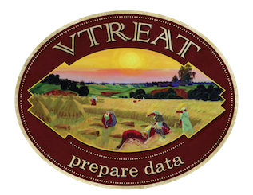
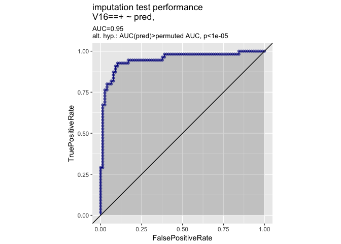

This article is on preparing data for modeling in [R](https://cran.r-project.org) using [`vtreat`](https://CRAN.R-project.org/package=vtreat) and it relation to missing value imputation. `vtreat` solves a lot more problems than just missing values (including novel values, and large cardinality categorical variables), but handling of missing values is of course a point of interest.

`vtreat`: imputation
====================

`vtreat` is a bit different than missing value imputation in that it supplies a number of other services, and when it does impute missing values (by simple means estimation) it leaves a mark that such an imputation was applied. We have found in practice leaving the information in is very advantageous when values are not simply "missing at random." `vtreat` can also be combined with external missing value imputation for a combined approach.



Our example
-----------

Suppose we wish to work with some data. Our example task is to train a classification model for credit approval using the [`ranger`](https://CRAN.R-project.org/package=ranger) implementation of the random forests method. We will take our data from [John Ross Quinlan's re-processed "credit approval" dataset](https://archive.ics.uci.edu/ml/datasets/Credit+Approval) hosted at [Lichman, M. (2013). UCI Machine Learning Repository, http://archive.ics.uci.edu/ml; Irvine, CA: University of California, School of Information and Computer Science](http://archive.ics.uci.edu/ml).

For convenience we have copied the data to our working directory [here](https://github.com/WinVector/Examples/tree/master/vtreat). We start by loading the data, identifying the outcome, and splitting the data into training and evaluation portions:

``` r
# load data
d <- read.table(
  'crx.data.txt',
  header = FALSE,
  sep = ',',
  stringsAsFactors = FALSE,
  na.strings = '?'
)

# prepare outcome column and level
outcome <- 'V16'
positive <- '+'
d[[outcome]] <- as.factor(d[[outcome]])

# identify variables
vars <- setdiff(colnames(d), outcome)

# split into train and test/evaluation
set.seed(25325)
isTrain <- runif(nrow(d)) <= 0.8
dTrain <- d[isTrain, , drop = FALSE]
dTest <- d[!isTrain, , drop = FALSE]
rm(list = 'd')
```

Missing value imputation alone.
-------------------------------

We could try to model directly on the original variables without `vtreat` as below.

``` r
library("ranger")
library("mice")
library("dplyr")
```

    ## 
    ## Attaching package: 'dplyr'

    ## The following objects are masked from 'package:stats':
    ## 
    ##     filter, lag

    ## The following objects are masked from 'package:base':
    ## 
    ##     intersect, setdiff, setequal, union

``` r
dcomb <- rbind(dTrain[, vars, drop=FALSE], 
               dTest[, vars, drop=FALSE])
charCols <- colnames(dcomb)[vapply(dcomb, 
                                   is.character,
                                   logical(1))]
for(ci in charCols) {
  dcomb[[ci]] <- as.factor(dcomb[[ci]])
}
isTrain <- rep(FALSE, nrow(dcomb))
isTrain[seq_len(nrow(dTrain))] <- TRUE
impute <- mice(dcomb, method='rf')
```

    ## 
    ##  iter imp variable
    ##   1   1  V1  V2  V4  V5  V6  V7  V14
    ##   1   2  V1  V2  V4  V5  V6  V7  V14
    ##   1   3  V1  V2  V4  V5  V6  V7  V14
    ##   1   4  V1  V2  V4  V5  V6  V7  V14
    ##   1   5  V1  V2  V4  V5  V6  V7  V14
    ##   2   1  V1  V2  V4  V5  V6  V7  V14
    ##   2   2  V1  V2  V4  V5  V6  V7  V14
    ##   2   3  V1  V2  V4  V5  V6  V7  V14
    ##   2   4  V1  V2  V4  V5  V6  V7  V14
    ##   2   5  V1  V2  V4  V5  V6  V7  V14
    ##   3   1  V1  V2  V4  V5  V6  V7  V14
    ##   3   2  V1  V2  V4  V5  V6  V7  V14
    ##   3   3  V1  V2  V4  V5  V6  V7  V14
    ##   3   4  V1  V2  V4  V5  V6  V7  V14
    ##   3   5  V1  V2  V4  V5  V6  V7  V14
    ##   4   1  V1  V2  V4  V5  V6  V7  V14
    ##   4   2  V1  V2  V4  V5  V6  V7  V14
    ##   4   3  V1  V2  V4  V5  V6  V7  V14
    ##   4   4  V1  V2  V4  V5  V6  V7  V14
    ##   4   5  V1  V2  V4  V5  V6  V7  V14
    ##   5   1  V1  V2  V4  V5  V6  V7  V14
    ##   5   2  V1  V2  V4  V5  V6  V7  V14
    ##   5   3  V1  V2  V4  V5  V6  V7  V14
    ##   5   4  V1  V2  V4  V5  V6  V7  V14
    ##   5   5  V1  V2  V4  V5  V6  V7  V14

``` r
reps <- lapply(seq_len(5),
       function(i) {
         di <- complete(impute, i)
         di$replication <- i
         dTraini <- di[isTrain, ]
         dTraini[[outcome]] <- dTrain[[outcome]]
         dTraini$origRowNum <- seq_len(nrow(dTrain))
         dTesti <- di[!isTrain, ]
         dTesti$origRowNum <- seq_len(nrow(dTest))
         dTesti[[outcome]] <- dTest[[outcome]]
         data_frame(train= list(dTraini), 
                    test= list(dTesti))
                                
       })
reps <- bind_rows(reps)
rTrain <- bind_rows(reps$train)
rTest <- bind_rows(reps$test)

f <- paste(outcome, 
           paste(vars, collapse = ' + '), 
           sep = ' ~ ')
model <- ranger(as.formula(f),  
                probability = TRUE,
                data = rTrain)
pred <- predict(model, 
                data=rTest, 
                type='response')
rTest$pred <- pred$predictions[,positive]
rTest %>% 
  group_by(origRowNum) %>%
  summarize(pred = mean(pred)) %>%
  arrange(origRowNum) -> preds
dTest$pred <- preds$pred
```

And we are now ready to examine the model's out of sample performance. In this case we are going to use ROC/AUC as our evaluation.

``` r
library("WVPlots")
WVPlots::ROCPlot(dTest, 
                 'pred', outcome, positive,
                 'imputation test performance')
```



The imputed model performance is excellent. The trade-off is the imputed values are probably better replacement values than `vtreat`'s mere means, however `vtreat`'s indication of missingness is a powerful modeling feature that is not to be ignored.

An interesting strategy is to combine the methodologies.

Combined methodology
--------------------

``` r
library("vtreat")

cfe <- vtreat::mkCrossFrameCExperiment(dTrain, vars,
                                       outcome, positive)
plan <- cfe$treatments
sf <- plan$scoreFrame
newVars <- sf$varName[(sf$sig<1/nrow(sf)) & (sf$code!='clean')]
# Mice doesn't like co-linear columns
# http://stackoverflow.com/questions/36330570/mice-does-not-impute-certain-columns-but-also-does-not-give-an-error/36331710#36331710
# http://stackoverflow.com/questions/38146475/r-mice-missing-data-still-exist-after-calling-mice-when-no-of-variable-is-lar

xTrain <- cbind(dTrain[, vars, drop=FALSE],
                cfe$crossFrame[ , c(newVars,outcome), drop=FALSE])
xTest <- cbind(dTest[, vars, drop=FALSE],
               vtreat::prepare(plan, dTest, 
                         pruneSig = NULL, 
                         varRestriction = newVars))
xvars <- c(vars, newVars)

dcomb <- rbind(xTrain[, xvars, drop=FALSE], 
               xTest[, xvars, drop=FALSE])
charCols <- colnames(dcomb)[vapply(dcomb, 
                                   is.character,
                                   logical(1))]
for(ci in charCols) {
  dcomb[[ci]] <- as.factor(dcomb[[ci]])
}
isTrain <- rep(FALSE, nrow(dcomb))
isTrain[seq_len(nrow(xTrain))] <- TRUE
impute <- mice(dcomb, method='rf')
```

    ## 
    ##  iter imp variable
    ##   1   1  V1  V2  V4  V5  V6  V7  V14
    ##   1   2  V1  V2  V4  V5  V6  V7  V14
    ##   1   3  V1  V2  V4  V5  V6  V7  V14
    ##   1   4  V1  V2  V4  V5  V6  V7  V14
    ##   1   5  V1  V2  V4  V5  V6  V7  V14
    ##   2   1  V1  V2  V4  V5  V6  V7  V14
    ##   2   2  V1  V2  V4  V5  V6  V7  V14
    ##   2   3  V1  V2  V4  V5  V6  V7  V14
    ##   2   4  V1  V2  V4  V5  V6  V7  V14
    ##   2   5  V1  V2  V4  V5  V6  V7  V14
    ##   3   1  V1  V2  V4  V5  V6  V7  V14
    ##   3   2  V1  V2  V4  V5  V6  V7  V14
    ##   3   3  V1  V2  V4  V5  V6  V7  V14
    ##   3   4  V1  V2  V4  V5  V6  V7  V14
    ##   3   5  V1  V2  V4  V5  V6  V7  V14
    ##   4   1  V1  V2  V4  V5  V6  V7  V14
    ##   4   2  V1  V2  V4  V5  V6  V7  V14
    ##   4   3  V1  V2  V4  V5  V6  V7  V14
    ##   4   4  V1  V2  V4  V5  V6  V7  V14
    ##   4   5  V1  V2  V4  V5  V6  V7  V14
    ##   5   1  V1  V2  V4  V5  V6  V7  V14
    ##   5   2  V1  V2  V4  V5  V6  V7  V14
    ##   5   3  V1  V2  V4  V5  V6  V7  V14
    ##   5   4  V1  V2  V4  V5  V6  V7  V14
    ##   5   5  V1  V2  V4  V5  V6  V7  V14

``` r
reps <- lapply(seq_len(5),
       function(i) {
         di <- complete(impute, i)
         di$replication <- i
         dTraini <- di[isTrain, ]
         dTraini[[outcome]] <- xTrain[[outcome]]
         dTraini$origRowNum <- seq_len(nrow(xTrain))
         dTesti <- di[!isTrain, ]
         dTesti$origRowNum <- seq_len(nrow(xTest))
         dTesti[[outcome]] <- xTest[[outcome]]
         data_frame(train= list(dTraini), 
                    test= list(dTesti))
                                
       })
reps <- bind_rows(reps)
rTrain <- bind_rows(reps$train)
rTest <- bind_rows(reps$test)
# mice had been skipping V2 and V14 in this pass for some reason
problems <- colnames(rTrain)[vapply(rTrain, 
                                    function(ci) {any(is.na(ci))}, 
                                    logical(1))]
print(problems)
```

    ## character(0)

``` r
xvars <- setdiff(xvars, problems)

f <- paste(outcome, 
           paste(xvars, collapse = ' + '), 
           sep = ' ~ ')
model <- ranger(as.formula(f),  
                probability = TRUE,
                data = rTrain[, c(outcome, xvars), drop=FALSE])
pred <- predict(model, 
                data=rTest[, xvars, drop=FALSE], 
                type='response')
rTest$pred <- pred$predictions[,positive]
rTest %>% 
  group_by(origRowNum) %>%
  summarize(pred = mean(pred)) %>%
  arrange(origRowNum) -> preds
xTest$pred <- preds$pred

WVPlots::ROCPlot(dTest, 
                 'pred', outcome, positive,
                 'cobmined test performance')
```


